<div align="center">

# MerchantMind

### Merchant Intelligence & Decision Platform

_An intelligent financial operating system for merchants that continuously understands their business, detects financial risks and opportunities, explains the evidence behind them, recommends quantified actions, keeps the merchant in control, and measures outcomes._

[](https://react.dev)
[](https://www.typescriptlang.org)
[](https://vite.dev)
[](https://tailwindcss.com)
[](https://github.com/webdevpraveen/merchantmind_hacksprint)
[](https://github.com/webdevpraveen/merchantmind_hacksprint)
[](https://merchantmindhacksprint.vercel.app)

[What is MerchantMind?](#what-is-merchantmind) • [The Problem](#the-problem) • [The Solution](#the-solution) • [Flagship Demo](#flagship-demo-scenario--rajesh-mobile) • [Architecture](#architecture) • [Pitch Deck](#official-hacksprint-presentation-deck) • [Judge Demo Flow](#recommended-judge-demo-flow) • [FAQ](#faq)

</div>

---

## What is MerchantMind?

MerchantMind is **not** a passive reporting dashboard, **not** a basic accounting app, **not** a POS terminal, and **not** a generic LLM chatbot with database access.

It is an **Intelligent Financial Operating System** designed for Indian retail and small business merchants. It continuously monitors a merchant’s operational cash, customer credit (Khata), supplier liabilities, inventory turnover, and digital payment streams to bridge the gap between raw financial telemetry and decisive operational action.

### The Autonomous Intelligence Lifecycle

$$\text{CONNECT} \longrightarrow \text{UNDERSTAND} \longrightarrow \text{MONITOR} \longrightarrow \text{DETECT} \longrightarrow \text{EXPLAIN} \longrightarrow \text{RECOMMEND} \longrightarrow \text{APPROVE} \longrightarrow \text{ACT} \longrightarrow \text{MEASURE}$$

### The Closed-Loop Decision Engine

$$\text{BUSINESS DATA} \longrightarrow \text{SIGNAL} \longrightarrow \text{OPPORTUNITY} \longrightarrow \text{EVIDENCE} \longrightarrow \text{RECOMMENDATION} \longrightarrow \text{MERCHANT APPROVAL} \longrightarrow \text{ACTION} \longrightarrow \text{MEASURED OUTCOME}$$

The platform operates on a single core thesis:

> **Indian retail merchants do not need more charts. They need to know what is happening in their business, why it is happening, what to do about it, how much cash they can recover, and what verifiable evidence proves it.**

---

## The Problem

Millions of Indian SMB and retail merchants operate across fragmented, disconnected financial tools:

| Data Silo | Current Reality | Practical Pain Point |
|---|---|---|
| **Payment Telemetry** | Paytm QR, Soundbox, UPI terminals | Inflows scattered across settlement schedules, batch deductions, and transaction apps. |
| **Bank Current Accounts** | NetBanking portals, monthly PDF statements | Balances are only viewed after end-of-day reconciliation; overdraft fees hit unexpectedly. |
| **Customer Credit (Khata)** | Paper notebooks or stand-alone Khata apps | No automated link between customer credit latency and supplier invoice due dates. |
| **Supplier Obligations** | Paper challans, WhatsApp PDFs, distributor bills | Due dates kept in memory; early-payment cash discounts are missed. |
| **Inventory & Stock** | Physical shelf inspection, fragmented POS entries | Capital remains frozen in dead stock while high-velocity accessories stock out. |
| **Accounting Systems** | Tally Prime or periodic spreadsheets | Post-mortem record-keeping updated days or weeks after financial events transpire. |

### The Real-World Dilemma

A retail merchant running a ₹1.5L/month store routinely encounters this acute working capital cliff:

```
"I have ₹40,607 in my current account today.
My supplier bill of ₹45,000 from Sharma Telecom is due on Friday.
I have a net liquidity deficit of -₹4,393.
Where do I recover this money before Friday without taking an emergency 36% APR loan?"
```

Traditional dashboards show a historical revenue graph and an expense pie chart. **MerchantMind detects the cliff 5 days in advance, proves the exact ₹4,393 gap from primary records, pinpoints ₹3,700 in overdue Khata and ₹10,660 in dead stock, and pre-formulates 1-click executable actions to recover ₹11,500 before Friday.**

---

## The Solution

MerchantMind connects disparate business feeds into a normalized canonical model, running deterministic heuristic analyzers that convert passive data into closed-loop actions.

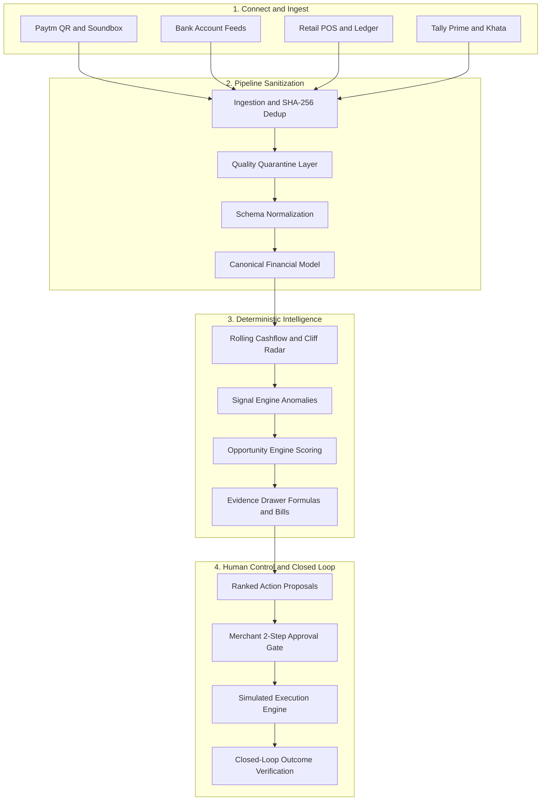

---

## Why It Is Different

| Dimension | Payment Dashboards | Accounting Software | BI Dashboards | Generic AI Chatbots | MerchantMind |
|---|---|---|---|---|---|
| **Primary Focus** | Transaction visibility | Historical bookkeeping | Retrospective charts | Freeform text generation | Proactive financial decisions & actions |
| **Core Question** | _"Did this UPI payment clear?"_ | _"What was my tax balance last month?"_ | _"What was revenue by week?"_ | _"How can I grow my retail store?"_ | _"What is at risk, why, how much is affected, and what action recovers it?"_ |
| **Intelligence Model** | None | Static rules & debit/credit ledgers | Aggregations & chart visualizations | Probabilistic language completion | Deterministic mathematical reasoning |
| **Explainability** | Raw payment receipts | Double-entry journals | Chart tooltips | Opaque LLM hallucinations | Verifiable calculation trees linked to source bills |
| **Execution** | None | Manual journal adjustments | None | None (text suggestions only) | 1-click approved actions with execution progress |
| **Human Guardrail** | N/A | Manual entry | N/A | Prompt-level instructions | Explicit 2-step confirmation sandbox |
| **Outcome Tracking** | Settlement status | Reconciled balance | Visual trend change | None | Closed-loop delta measurement (+₹7,107 surplus) |

---

## Core Capabilities

MerchantMind is structured into two synchronized environments: **World A (Public Product & Architecture Showcase)** and **World B (Merchant Operational Application)**.

### World A: Public Showcase & System Rigor

*   **Public Showcase (`PublicShowcaseView`):** High-level product storytelling answering the 5 Core Questions for Judges (`WHAT IS IT?`, `WHO IS IT FOR?`, `WHAT PROBLEM DOES IT SOLVE?`, `HOW DOES IT WORK?`, `WHY IS IT DIFFERENT?`).
*   **System Architecture (`ArchitectureView`):** Interactive visual topology detailing the 10-stage data pipeline, separating the deterministic financial core from optional conversational overlays.
*   **Paytm Ecosystem Integration (`PaytmEcosystemView`):** Technical documentation of 6 integration surfaces (QR Soundbox, EDC Smart POS, All-in-One Gateway, Payouts, Merchant Lending, Business App).
*   **Interactive Narrative Walkthrough (`HowItWorksView`):** Step-by-step walkthrough mapping real retail situations to system responses.
*   **Product FAQ (`ProductFaqGrid`):** 12 straightforward technical answers addressing architecture, AI boundaries, and production readiness.

### World B: Merchant Operational Application

*   **Executive Command Center (`CommandCenterView`):** Real-time pulse of the merchant’s business featuring the urgent Liquidity Squeeze Alert, working capital health metrics, priority signals, and recent activity timeline.
*   **Financial Health & Indicators (`FinancialHealthView`):** Gross margins, operating burn rate, 30-day runway projection, and liquidity coverage ratio ($0.90\times$).
*   **Cashflow Planner & Cliff Radar (`CashflowView`):** 14-day daily cashflow trajectory highlighting safe operational buffers and the impending supplier payment cliff.
*   **Khata & Receivables Ledger (`KhataReceivablesView`):** Ageing analysis ($0\text{--}7\text{d}, 8\text{--}30\text{d}, 31\text{--}60\text{d}, 61\text{--}90\text{d}, 90+\text{d}$), individual debtor ledgers, and automated payment reminder triggers.
*   **Supplier Payables (`SupplierPayablesView`):** Supplier invoices, maturity dates, prompt-payment cash discount opportunities, and credit line risk tracking.
*   **Inventory Velocity & Dead Stock (`InventoryView`):** SKU turnover tracking, stockout forecasting, and dead-stock capital recovery candidates.
*   **Customer Intelligence (`CustomersView`):** RFM segmentation (High Value, Growing, At Risk, Dormant), credit risk profiling, and payment latency metrics.
*   **Signal Radar (`SignalsView`):** Real-time feed of deterministic anomaly alerts across liquidity, receivables, inventory, and margin leakage.
*   **Opportunity Board (`OpportunitiesView`):** Multi-criteria scored and ranked financial interventions with financial stakes and potential gains.
*   **Evidence Drawer (`EvidenceDrawer`):** The platform’s core differentiator — displays step-by-step mathematical calculations, links to primary records (`BILL-SUP-201`, `INV-REC-101`), and trade-off analysis.
*   **Action Center & Approval Gateway (`ActionCenterView`):** Staged action lifecycle (`DRAFT → PENDING APPROVAL → APPROVED → EXECUTING → MEASURED`) with 2-step confirmation guardrails and closed-loop outcome verification.
*   **Data Connections Hub (`ConnectionsView`):** Live sync status across 6 data sources with interactive 7-stage sync simulation (`CONNECTING → AUTHENTICATING → FETCHING → NORMALIZING → VALIDATING → RECONCILING → COMPLETE`).
*   **Ingestion Pipeline & Quarantine (`IngestionView`):** Pipeline telemetry showing records processed, valid entities, quarantined anomalies, and canonical transformation logs.
*   **Immutable Audit Trail (`AuditTrailView`):** Timestamped ledger recording every signal detection, user approval, scenario modification, and sync event.
*   **Unified Transaction Ledger (`TransactionsView`):** Canonical log of multi-channel transactions across Paytm QR, bank transfers, POS cash, and UPI.
*   **Merchant Settings (`SettingsView`):** Business configuration, tax parameters (GSTIN), and banking linkages.
*   **Guided Judge Tour (`GuidedTourModal`):** Anchored 10-step guided tour walking evaluators through the complete product story in under 3 minutes.
*   **Scenario Controller (`TopNavbar`):** Dynamic scenario selector allowing evaluators to switch business conditions and observe deterministic updates across all views.

---

## Flagship Demo Scenario — Rajesh Mobile

> **Disclosure:** _All financial values, customer records, supplier invoices, and transaction logs are synthetic demonstration data engineered to provide reproducible, mathematically consistent evaluation. They do not represent real individuals, bank accounts, or proprietary merchant data._

### The Persona & Canonical Numbers

*   **Merchant:** Rajesh Kumar — Proprietor, *Rajesh Mobile & Accessories*
*   **Location:** Shop #14, Central Market, Raja Park Market, Jaipur, Rajasthan 302004
*   **GSTIN:** `08AABCR1234M1Z5` (Active Regular Taxpayer)
*   **Monthly Gross Revenue:** ₹1,42,800 (+8.4% MoM, 24.5% gross margin)
*   **Operating Cash Reserve:** ₹40,607 (SBI Current Account ending in `4910` + physical cash drawer)
*   **Safe Cash Buffer Target:** ₹45,000 (100% of rolling weekly liability requirements)
*   **Upcoming Supplier Invoice:** ₹45,000 (Sharma Telecom Distributor, `BILL-SUP-201`, due in 5 days on Oct 9)
*   **Immediate Net Liquidity Gap:** **-₹4,393** (`₹40,607 - ₹45,000 = -₹4,393`)

```
┌────────────────────────────────────────────────────────────────────────┐
│                   RAJESH MOBILE WORKING CAPITAL CRISIS                 │
├──────────────────────────┬─────────────────────────────────────────────┤
│ Available Cash           │  ₹40,607                                    │
│ Supplier Obligation Due  │  ₹45,000 (Sharma Telecom, Due in 5 Days)    │
│ Net Immediate Deficit    │ -₹4,393 (Deficit on Oct 9)                 │
├──────────────────────────┼─────────────────────────────────────────────┤
│ UNTAPPED CAPITAL LEVERS  │                                             │
│ • Overdue Khata Ledgers  │  ₹3,700 (Amit Verma ₹2,200 + Neha ₹1,500)   │
│ • Locked Dead Stock      │ ₹10,660 (iPhone 11 cases, pouches, OTGs)    │
│ Total Modeled Recovery   │ +₹11,500 (Khata ₹3,700 + Clearance ₹7,800)  │
├──────────────────────────┼─────────────────────────────────────────────┤
│ PROJECTED OUTCOME        │                                             │
│ Post-Recovery Position   │ +₹7,107 Safe Working Cushion               │
└──────────────────────────┴─────────────────────────────────────────────┘
```

### The 5-Step Resolution Narrative

1.  **Detection:** System identifies that invoice `BILL-SUP-201` (₹45,000) exceeds projected operational balance by ₹4,393 on Friday. Fires `SIG-LIQ-CLIFF`.
2.  **Attribution:** The Evidence Drawer isolates the exact arithmetic: `₹40,607 - ₹45,000 = -₹4,393`. Links directly to source records `BILL-SUP-201`, `INV-REC-101`, and `INV-REC-103`.
3.  **Formulation:** Opportunity Engine recommends two immediate capital recovery levers:
    *   *Action #ACT-01:* Send polite WhatsApp payment reminders with instant Paytm UPI paylinks to Amit Verma (₹2,200 / 38 days) and Neha Sharma (₹1,500 / 34 days). Expected: +₹3,700.
    *   *Action #ACT-02:* Run a 48-hour flash clearance bundle at 25% discount on stagnant iPhone 11 cases and micro-USB OTG adapters. Expected: +₹7,800 net cash.
4.  **Merchant Approval:** Rajesh inspects the Evidence Drawer, confirms the low relationship risk and minimal effort, and approves Action #ACT-01 and #ACT-02 through the 2-step confirmation modal.
5.  **Measured Outcome:** Simulated execution delivers payment reminders and executes clearance pricing. Inbound UPI settlements are verified, lifting Rajesh’s net position from **-₹4,393** to **+₹7,107** surplus.

---

## Signal → Opportunity → Action

```
RAW BUSINESS DATA
  ├── Paytm QR batch settlement: ₹14,200
  ├── Supplier Invoice: BILL-SUP-201 (₹45,000 due in 5d)
  └── Overdue Khata: INV-REC-101 (Amit Verma ₹2,200, 38d)
         │
         ▼
BUSINESS SIGNAL (SIG-LIQ-CLIFF)
  "Impending liquidity deficit of -₹4,393 detected for Friday Oct 9."
         │
         ▼
FINANCIAL OPPORTUNITY (OPP-01)
  "Bridge ₹4,393 liquidity gap through targeted Khata recovery & dead stock clearance."
  Priority Score: 94/100 • Financial Exposure: ₹45,000 • Potential Gain: ₹11,500
         │
         ▼
VERIFIABLE EVIDENCE (EVI-01)
  Formula: ₹40,607 (SBI Cash) - ₹45,000 (Sharma Telecom Bill) = -₹4,393 Deficit
  Contributing Records: BILL-SUP-201, INV-REC-101, INV-REC-103, SKU-CS-IP11
         │
         ▼
RECOMMENDED ACTIONS
  ├── ACT-01: WhatsApp UPI Payment Link dispatch to overdue Khata accounts (+₹3,700)
  ├── ACT-02: Flash clearance sale on 3 obsolete accessory SKUs (+₹7,800)
  └── ACT-03: Request 7-day invoice split extension from Sharma Telecom
         │
         ▼
MERCHANT APPROVAL GATE
  Proprietor reviews trade-offs, risk ratings, and approves ACT-01 & ACT-02.
         │
         ▼
EXECUTION LIFECYCLE
  DRAFT → PENDING APPROVAL → APPROVED → EXECUTING → SENT → MEASURED
         │
         ▼
MEASURED OUTCOME
  ₹3,700 collected + ₹7,800 cleared = +₹11,500 cash inflow.
  Ending cash balance: ₹52,107. After ₹45,000 supplier payment: +₹7,107 safe cushion.
```

---

## Architecture

### Current Implemented Prototype Architecture

The current implementation is a high-fidelity frontend architecture operating on a centralized deterministic state store and a service abstraction layer.

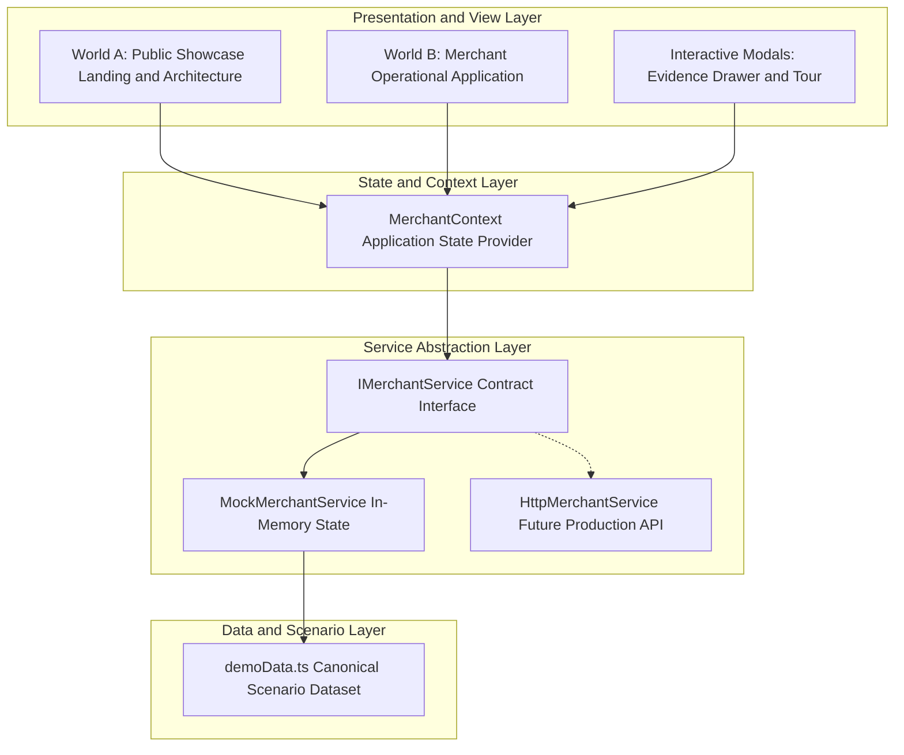

### Production Direction (Target Backend Architecture)

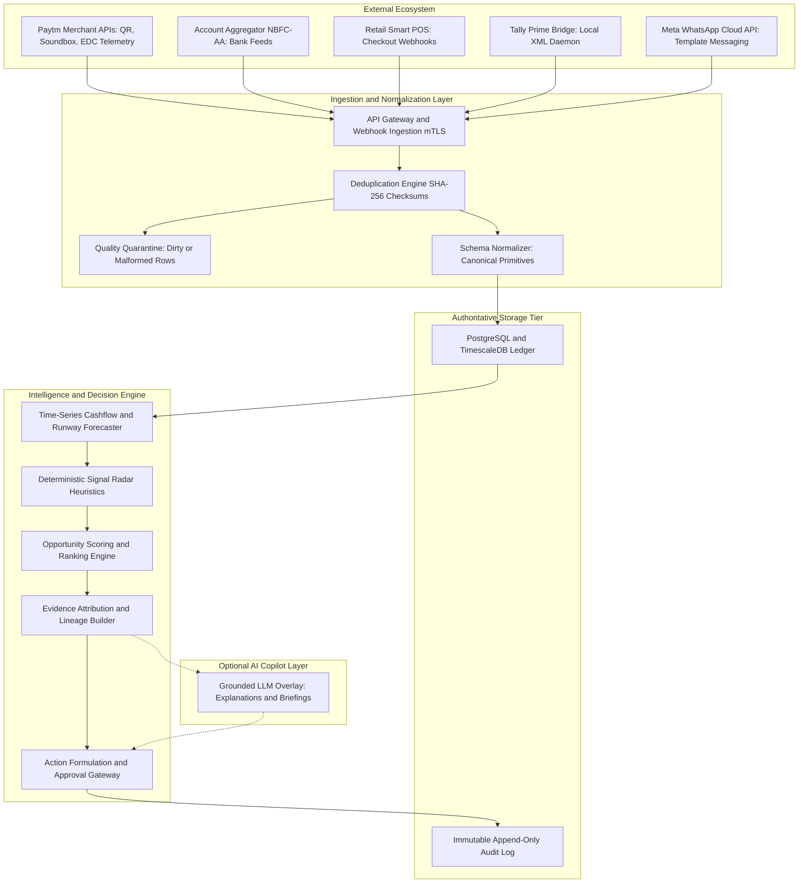

---

## Deterministic Core + AI Boundary

A foundational architectural principle of MerchantMind is the strict separation between deterministic business calculations and probabilistic natural language generation.

```
┌────────────────────────────────────────────────────────────────────────┐
│                   THE ARCHITECTURAL SEPARATION                         │
├────────────────────────────────────┬───────────────────────────────────┤
│ 1. THE DETERMINISTIC CORE          │ 2. OPTIONAL AI COPILOT OVERLAY    │
│    (Authoritative Ground Truth)    │    (Conversational Assistant)     │
├────────────────────────────────────┼───────────────────────────────────┤
│ • Ledger balances & cash arithmetic│ • Multi-lingual natural language  │
│ • Net liquidity gap calculations   │ • Explaining findings in Hindi    │
│ • Khata ageing days & thresholds   │ • Courteous WhatsApp draft tone   │
│ • Inventory velocity & dead stock  │ • Voice query interpretation      │
│ • Multi-criteria priority scores   │ • Executive briefing summaries    │
│ • Action eligibility gates         │ • Contextual merchant Q&A         │
├────────────────────────────────────┴───────────────────────────────────┤
│ RULE: LLMs never calculate numbers, never invent financial balances,   │
│       and never execute financial actions autonomously.                │
└────────────────────────────────────────────────────────────────────────┘
```

> **"The LLM is replaceable. The merchant intelligence platform is the product."**

If generative AI capabilities are disabled or swapped, MerchantMind continues to operate with 100% mathematical integrity because every alert, calculation, and recommended action derives from the deterministic core.

---

## Data Model

The platform canonicalizes disparate inputs into strongly typed TypeScript contracts defined in `src/types/index.ts`:

*   **`MerchantProfile`:** Legal business identity, proprietor name, GSTIN, registered market address, verified bank account, active scenario.
*   **`FinancialHealthMetrics`:** Monthly revenue, gross margins, available cash, safe cash buffer target, cash runway in days, liquidity coverage ratio, total receivables, overdue credit, urgent 7-day payables, dead stock valuation, net liquidity gap.
*   **`CashflowDatapoint`:** Daily calendar date, inflow, outflow, net daily balance, actual balance, projected balance, safe buffer threshold, payment cliff annotation flag.
*   **`ReceivableRecord`:** Customer identifier, invoice reference, original invoice amount, outstanding balance, invoice date, due date, days overdue, ageing bucket, credit risk classification.
*   **`PayableRecord`:** Supplier name, invoice number, category, total invoice amount, due date, days until due, payment urgency status, prompt-payment cash discount terms.
*   **`InventoryItem`:** SKU code, product description, category, current stock quantity, unit cost price, retail price, total inventory valuation, days in inventory, monthly sales velocity, dead stock status.
*   **`CustomerProfile`:** Customer name, contact number, RFM customer segment (`HIGH_VALUE`, `GROWING`, `AT_RISK`, `DORMANT`), lifetime spend, order count, outstanding Khata, payment latency.
*   **`BusinessSignal`:** Unique signal code (`SIG-LIQ-CLIFF`, `SIG-REC-OVERDUE`, `SIG-INV-DEADSTOCK`), severity, category, detection timestamp, metric impact, confidence score, deterministic trigger formula, linked entity IDs.
*   **`Opportunity`:** Multi-criteria priority, urgency in days, financial exposure, modeled recovery potential, confidence percentage, summary, step-by-step arithmetic explanation, trade-off analysis, linked evidence ID, recommended action IDs.
*   **`EvidenceRecord`:** Explicit formula, breakdown steps with positive and negative inputs, contributing primary records, audit timeline events, risk ratings, trade-offs.
*   **`RecommendedAction`:** Action code, target entity, channel type (`WHATSAPP_PAYLINK`, `CLEARANCE_PROMO`, `SUPPLIER_RESTRUCTURE`), expected recovery amount, execution effort, risk level, multi-stage execution lifecycle status.
*   **`DataConnection`:** Provider identifier, connection category, integration type, connection status, last sync timestamp, records processed, health percentage.
*   **`IngestionJobLog`:** Batch ID, source provider, stage status, records ingested, records validated, records quarantined, latency.
*   **`AuditEvent`:** Immutable event log recording actor, category, action title, entity reference, timestamp, and summary.
*   **`TransactionRecord`:** Unified transaction ledger entry recording timestamp, customer, channel, amount, payment method, reconciliation status.

---

## Ingestion & Reconciliation

MerchantMind ingests data following an append-only pipeline designed for dirty, heterogeneous real-world data:

$$\text{Source Stream} \longrightarrow \text{Validation} \longrightarrow \text{Deduplication (SHA-256)} \longrightarrow \text{Normalization} \longrightarrow \text{Reconciliation} \longrightarrow \text{Canonical Entities}$$

### Quality Quarantine Layer

Real-world merchant data frequently contains malformed rows, missing identifiers, or negative quantities. The Ingestion Engine validates schema conformity before database mutation. Invalid or ambiguous records are isolated in the **Quality Quarantine Ledger** with explicit error flags (e.g., `MISSING_GSTIN`, `INVALID_TIMESTAMP`, `NEGATIVE_INVENTORY_DELTA`), ensuring dirty feeds cannot pollute the merchant's financial ground truth.

### Manual CSV Import Fallback

Automated API bridges represent the primary integration channel. However, MerchantMind provides a drag-and-drop CSV import dropzone as an onboarding, recovery, and offline fallback mechanism.

> **Design Principle:** _"Connect once. Sync continuously. Monitor automatically."_

---

## Opportunity Engine

The Opportunity Engine ranks detected financial issues to prevent notification fatigue and ensure the merchant attends to the most critical capital levers first.

### Priority Scoring Formula

$$\text{Priority Score} = 0.35 \times \text{Urgency} + 0.35 \times \text{Financial Stakes} + 0.20 \times \text{Confidence} + 0.10 \times \text{Evidence Rigor}$$

*   **Urgency ($0.35$):** Time proximity to financial impact. A bill due in 5 days scores significantly higher than a discount expiring in 25 days.
*   **Financial Stakes ($0.35$):** Total monetary exposure relative to the merchant's monthly revenue and liquid cash.
*   **Confidence ($0.20$):** Completeness of reconciled data backing the signal (e.g., verified bank statement vs unconfirmed ledger entry).
*   **Evidence Rigor ($0.10$):** Number of cross-referenced source documents corroborating the finding.

Every opportunity is deterministically scored, ranked, and classified into `CRITICAL`, `HIGH`, `MEDIUM`, or `LOW`.

---

## Evidence-First Explainability

Every material finding in MerchantMind must satisfy the **5-Point Proof Standard** in the Evidence Drawer:

1.  **WHAT was detected?** Clear, jargon-free statement of the condition.
2.  **WHY does it matter?** Immediate business consequence (e.g., vendor credit hold, bank bounce penalty).
3.  **WHAT is the exact calculation?** Complete mathematical arithmetic:
    $$\text{Available Cash (₹40,607)} - \text{Due Bill (₹45,000)} = \text{Net Deficit (-₹4,393)}$$
4.  **WHICH primary records prove it?** Clickable links to specific invoices (`BILL-SUP-201`), Khata ledgers (`INV-REC-101`), and inventory items.
5.  **WHAT are the trade-offs?** Analysis of each available intervention (e.g., flash clearance sacrifices 15% margin to unlock immediate cash).

---

## Action Engine & Human Control

MerchantMind strictly enforces **Human-in-the-Loop Governance**. The platform never initiates external communications or modifies financial state without explicit merchant authorization.

### Action Execution Lifecycle

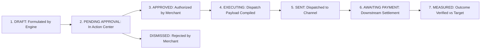

### 2-Step Confirmation Guardrail

Sensitive actions (such as dispatching payment reminder links or altering retail prices) trigger a modal dialogue detailing:
*   Action target entity and contact number
*   Expected recovery amount vs potential relationship risk
*   Explicit disclosure: _"This is an action execution simulation in Demo Mode"_

---

## Connections & Paytm Ecosystem

```
┌────────────────────────────────────────────────────────────────────────┐
│                   DATA CONNECTIONS ARCHITECTURE                        │
├─────────────────────────┬──────────────────────────────────────────────┤
│ CONNECTION SURFACE      │ CURRENT STATUS (PROTOTYPE)                   │
├─────────────────────────┼──────────────────────────────────────────────┤
│ 1. Paytm QR & Soundbox  │ Demo Connected (Simulated transaction stream)│
│ 2. SBI Current Account  │ Demo Connected (Account Aggregator mock)     │
│ 3. Retail Smart POS     │ Demo Connected (Checkout webhook simulation) │
│ 4. Tally Prime / XML    │ Connector Ready (Local bridge daemon mock)   │
│ 5. Inventory Barcode    │ Connected (Simulated stock scan updates)     │
│ 6. WhatsApp Business    │ Demo Connected (Simulated Cloud API sandbox) │
└─────────────────────────┴──────────────────────────────────────────────┘
```

### Paytm-Aligned Integration Layer

MerchantMind is architected to interface cleanly with Paytm's merchant technology ecosystem:

*   **Paytm QR & Soundbox Telemetry:** Ingestion of real-time audio confirmation and UPI payment callbacks into the canonical transaction ledger.
*   **Paytm All-in-One POS:** Real-time synchronization of counter sales, card disbursements, and digital payment receipts.
*   **Paytm Payouts & Vendor Invoicing:** Automated reconciliation of supplier invoice payments against bank balance debits.
*   **Paytm Merchant Lending:** Providing underwriters with deterministic business health, cash runway, and verified Khata recovery rates to reduce loan risk premiums.

> **Honest Prototype Boundary:** _The current implementation uses synthetic telemetry data to demonstrate integration schemas and data flows. It does not connect to live production banking networks or proprietary Paytm merchant APIs._

---

## Live Demo & Scenarios

### 7-Stage Live Sync Simulation

Evaluators can open the **Data Connections Hub** and trigger a live synchronization cycle that simulates the full enterprise ingestion pipeline across 7 stages:

```
[1. CONNECTING]   → Establishing secure TLS connection to provider endpoint
[2. AUTHENTICATING]→ Verifying OAuth2 merchant token and credential signatures
[3. FETCHING]     → Streaming raw transaction batch payloads
[4. NORMALIZING]  → Mapping heterogeneous JSON schemas to canonical primitives
[5. VALIDATING]   → Running data integrity checks and routing corrupted rows to quarantine
[6. RECONCILING]  → Matching bank balance against ledger entries and settlement records
[7. COMPLETE]     → Canonical state updated; signals and opportunities recomputed
```

### 6 Switchable Deterministic Scenarios

The `TopNavbar` includes a scenario manager allowing evaluators to swap between 6 pre-configured merchant conditions:

1.  **Rajesh Mobile Crisis (Default Flagship):** Supplier payment cliff with -₹4,393 deficit, ₹3,700 trapped Khata, and ₹10,660 dead stock.
2.  **Healthy Business:** Robust surplus (+₹56,500 cushion), zero overdue Khata, and healthy inventory turnover.
3.  **Cash Pressure:** Tight working capital buffer (-₹3,000 gap) with moderate supplier obligations.
4.  **Receivables Risk:** Chronic customer credit defaults with ₹14,800 trapped past 45 days.
5.  **Inventory Risk:** Severe stock stagnation with ₹28,400 frozen in 4 discontinued accessory models.
6.  **Supplier Payment Cliff:** Acute 48-hour emergency with ₹52,000 distributor bill due against ₹31,200 cash (-₹20,800 deficit).

---

## Official HackSprint Presentation Deck

Comprehensive pitch deck presented at **HackSprint 24-Hour Hackathon** (Manipal Academy of Higher Education, MAHE):

<div align="center">

### Slide 1: HackSprint Title & Team Introduction
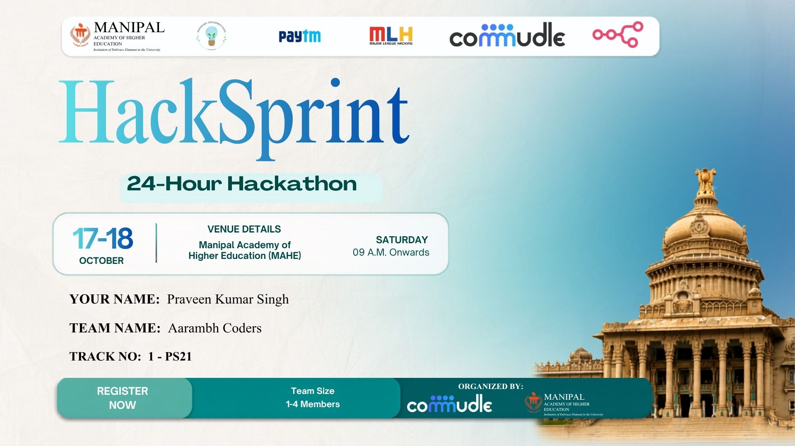

### Slide 2: Problem Statement & Solution Architecture
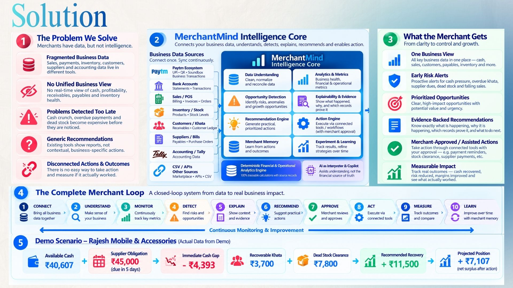

### Slide 3: Tech Stack & System Architecture
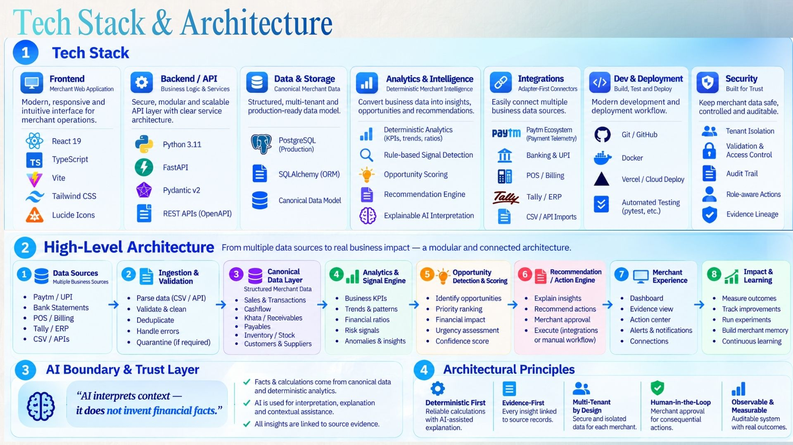

### Slide 4: Data Processing Pipeline & Scalability
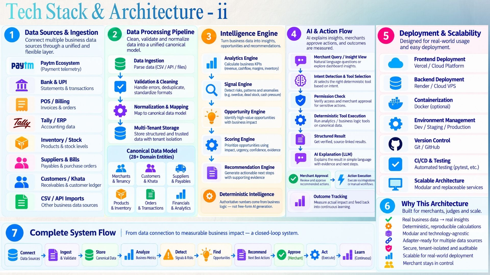

### Slide 5: Canonical Data Flow & Closed-Loop Engine
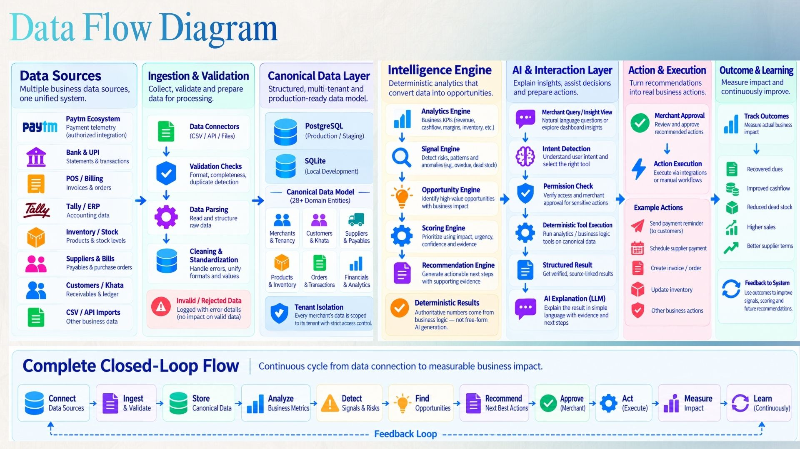

### Slide 6: Product UI Walkthrough & Verification Proof
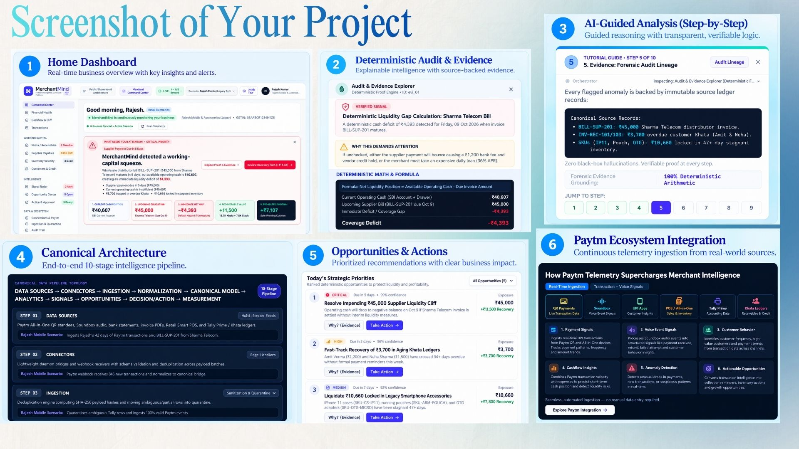

### Slide 7: Real-World Integrations, Roadmap & Live Links
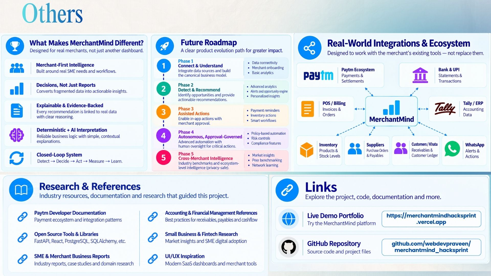

</div>

---

## Repository Structure

```
merchantmind_hacksprint/
├── docs/
│   ├── MASTER_BLUEPRINT.md            # Comprehensive architecture & design document
│   └── PROJECT_STATE.md               # Implementation progress & verification tracker
├── public/
│   ├── favicon.svg                    # Brand favicon
│   └── icons.svg                      # Vector sprite definitions
├── src/
│   ├── assets/
│   │   ├── hero.png                   # High-resolution platform preview screenshot
│   │   ├── ppt-image/                 # Official HackSprint pitch deck presentation slides (1.jpg - 7.jpg)
│   │   ├── react.svg                  # React ecosystem vector
│   │   └── vite.svg                   # Vite toolchain vector
│   ├── components/
│   │   ├── connections/
│   │   │   ├── ConnectionDetailsModal.tsx     # Connection inspect & config modal
│   │   │   └── LiveSyncSimulationModal.tsx    # 7-stage live sync animation & telemetry
│   │   ├── intelligence/
│   │   │   ├── MerchantActivityTimeline.tsx   # Live activity timeline feed
│   │   │   └── SignalActionFlowCard.tsx       # Decision card linking signal to action
│   │   ├── showcase/
│   │   │   └── ProductFaqGrid.tsx             # 12-question technical FAQ grid
│   │   └── ui/
│   │       ├── Badge.tsx                      # FinTech design system status badge
│   │       ├── Button.tsx                     # Polymorphic button with loading states
│   │       ├── Card.tsx                       # Structural container card
│   │       ├── Drawer.tsx                     # Slide-over drawer container
│   │       └── Modal.tsx                      # Centered dialog backdrop & container
│   ├── context/
│   │   └── MerchantContext.tsx        # Centralized application state & service provider
│   ├── layouts/
│   │   ├── AppShell.tsx               # World B merchant app shell layout
│   │   ├── AppSidebar.tsx             # 5-section collapsible sidebar navigation
│   │   ├── DemoModeBanner.tsx          # Sandbox disclaimer banner & reset trigger
│   │   ├── EvidenceDrawer.tsx         # Slide-over calculation breakdown & source proof
│   │   ├── GuidedTourModal.tsx        # 10-step anchored judge walkthrough
│   │   ├── PublicShell.tsx            # World A public showcase shell layout
│   │   └── TopNavbar.tsx              # World switcher, scenario selector & demo controller
│   ├── mock/
│   │   └── demoData.ts                # 1,195 lines of canonical deterministic scenario records
│   ├── services/
│   │   ├── MockMerchantService.ts     # In-memory implementation of IMerchantService
│   │   └── types.ts                   # IMerchantService interface (22 typed methods)
│   ├── types/
│   │   └── index.ts                   # Core domain data contracts & schemas
│   ├── utils/
│   │   ├── cn.ts                      # Tailwind class variance utility (clsx + twMerge)
│   │   └── formatters.ts              # INR currency (₹) and Indian date formatting
│   ├── views/
│   │   ├── ActionCenterView.tsx       # Approval queue & execution simulation
│   │   ├── ArchitectureView.tsx       # Interactive 10-stage pipeline topology
│   │   ├── AuditTrailView.tsx         # Immutable event & decision audit ledger
│   │   ├── CashflowView.tsx           # Daily cash trajectory & cliff radar
│   │   ├── CommandCenterView.tsx      # Executive merchant dashboard & squeeze alert
│   │   ├── ConnectionsView.tsx        # Data sources & live sync simulation
│   │   ├── CustomersView.tsx          # RFM segments & credit risk profiles
│   │   ├── FinancialHealthView.tsx    # P&L indicators, gross margin, burn rate
│   │   ├── HowItWorksView.tsx         # Narrative lifecycle walkthrough
│   │   ├── IngestionView.tsx          # Ingestion telemetry & quality quarantine
│   │   ├── InventoryView.tsx          # SKU velocity & dead stock recovery
│   │   ├── KhataReceivablesView.tsx   # Ageing buckets & customer credit ledgers
│   │   ├── OpportunitiesView.tsx      # Multi-criteria ranked financial opportunities
│   │   ├── PaytmEcosystemView.tsx     # Paytm integration surfaces & schemas
│   │   ├── PublicShowcaseView.tsx     # World A landing & 5 core judge questions
│   │   ├── SettingsView.tsx           # Merchant business configuration & GSTIN
│   │   ├── SignalsView.tsx            # Deterministic anomaly detection radar
│   │   ├── SupplierPayablesView.tsx   # Supplier bills & payment schedules
│   │   └── TransactionsView.tsx       # Unified multi-channel transaction ledger
│   ├── App.css                        # Application-wide component animations
│   ├── App.tsx                        # Root router & view coordinator
│   ├── index.css                      # Tailwind CSS 4 tokens & typography
│   └── main.tsx                       # React 19 application entry point
├── package.json                       # Dependencies & build scripts
├── tsconfig.json                      # TypeScript configuration
├── vercel.json                        # Vercel SPA rewrite deployment configuration
└── vite.config.ts                     # Vite bundler configuration
```

---

## Recommended Judge Demo Flow

To evaluate MerchantMind in **3 to 4 minutes**, follow this recommended path:

```
[00:00 - 00:45] World A: Public Showcase
  └── Review the core thesis, the 5 Judge Questions, and the 10-stage pipeline topology.
  └── Notice the distinction between the Deterministic Financial Core and the AI Copilot.

[00:45 - 01:30] World B: Executive Command Center
  └── Click "Switch to Merchant App" or "Launch Interactive Demo".
  └── Observe the Liquidity Squeeze Alert: ₹40,607 cash vs ₹45,000 Sharma Telecom bill due in 5 days.
  └── Note the net deficit of -₹4,393 and the potential recovery of +₹11,500.

[01:30 - 02:15] Inspect Evidence Proof (The Core Differentiator)
  └── Click "Inspect Evidence" on the Command Center banner.
  └── The Evidence Drawer slides out: review the exact arithmetic formula.
  └── Click source records (BILL-SUP-201, INV-REC-101) to verify line-item provenance.

[02:15 - 03:00] Action Approval & Execution Simulation
  └── Navigate to Action Center.
  └── Click "Review & Approve" on Action #ACT-01 (WhatsApp UPI reminders).
  └── Observe the 2-step confirmation modal with demo guardrail disclosures.
  └── Watch the execution lifecycle transition: APPROVED → EXECUTING → SENT → MEASURED.
  └── Check Closed-Loop Outcome Verification: position transforms from -₹4,393 to +₹7,107.

[03:00 - 03:30] Data Connections & Live Sync Simulation
  └── Navigate to Connections.
  └── Click "Simulate Live Sync" to observe the 7-stage pipeline animation.
  └── Inspect Ingestion Telemetry: 42 records processed, 0 schema errors, 1 record quarantined.

[03:30 - 04:00] Guided Tour & Scenario Switcher
  └── Launch the 10-Step Guided Tour from the top navbar.
  └── Use the Scenario Switcher to test "Healthy Business" or "Inventory Risk" and watch all views update.
```

---

## Engineering Principles

*   **Deterministic Financial Core:** Financial figures, liquidity shortfalls, aging calculations, and action formulations are computed using exact arithmetic. Probabilistic models do not touch financial calculations.
*   **Centralized Single Source of Truth:** All views, metrics, and indicators derive from a canonical dataset (`demoData.ts`). No component hardcodes conflicting financial figures.
*   **Service Abstraction Layer:** The presentation tier interfaces with state solely via `IMerchantService`. Migrating to a production REST/GraphQL backend requires swapping `MockMerchantService` with `HttpMerchantService` without altering UI components.
*   **Evidence-First Decision Making:** No recommendation is displayed without an accompanying verifiable calculation tree and primary source record references.
*   **Human-in-the-Loop Governance:** The system never executes external communications, alters inventory pricing, or initiates payment flows without merchant authorization.
*   **Explicit Demo Boundaries:** The prototype maintains transparent disclosure banners, simulated execution labels, and clear demarcations between current capabilities and production targets.

---

## Security, Privacy & Governance

### Prototype Design Principles

*   **Zero Credential Exposure:** The frontend contains no API keys, private tokens, or live database credentials.
*   **Synthetic Demonstration Data:** All names, telephone numbers, GSTIN numbers, and bank account sequences are synthetic and fictitious.
*   **Client-Side Sandboxing:** All simulated execution flows execute in memory within the client application; no external network requests are dispatched to real customers or suppliers.

### Production Architectural Target

*   **Tenant Isolation:** Row-level security (RLS) in PostgreSQL ensuring strict multi-tenant merchant boundary isolation.
*   **DPDP Act 2023 Alignment:** Architected to comply with India’s Digital Personal Data Protection Act: explicit merchant consent, purpose limitation, and data minimization.
*   **Hardware Token Security:** All integration connectors with Paytm and banking Account Aggregators utilize mutual TLS (mTLS) and hardware security modules (HSM) for credential custody.
*   **Immutable Audit Logging:** Every system access, recommendation formulation, and action authorization is written to an append-only audit trail.

---

## Current Status

```
┌────────────────────────────────────────────────────────────────────────┐
│                      CURRENT DEVELOPMENT STATUS                        │
├────────────────────────────────────────────────────────────────────────┤
│ 🟢 HACKATHON PROTOTYPE (COMPLETED & VERIFIED)                          │
│ • Full 20-view React 19 + TypeScript + Vite frontend application       │
│ • Complete 10-stage intelligence lifecycle and closed-loop execution   │
│ • Canonical 1,195-line deterministic demo dataset (Rajesh Mobile)      │
│ • Slide-over Evidence Drawer with formula breakdowns and source proof  │
│ • Action Center with 2-step confirmation modal and execution lifecycle │
│ • Closed-loop outcome measurement (-₹4,393 → +₹7,107 surplus)         │
│ • 6 data source connections with 7-stage live sync simulation          │
│ • Ingestion pipeline telemetry and quality quarantine ledger           │
│ • 10-step interactive Guided Judge Tour                                │
│ • 6 switchable deterministic demo scenarios                            │
│ • Production build passing cleanly (tsc -b && vite build — 0 errors)  │
│ • Vercel deployment configuration with SPA rewrite rules               │
├────────────────────────────────────────────────────────────────────────┤
│ 🔵 PRODUCTION DIRECTION (PLANNED NEXT PHASES)                          │
│ • Node.js / Python FastAPI backend microservices                       │
│ • PostgreSQL / TimescaleDB relational and time-series persistence       │
│ • Real Paytm Merchant API connector (OAuth2 / Webhooks)                │
│ • Account Aggregator (NBFC-AA) bank statement feed integration         │
│ • Tally Prime local bridge connector daemon                            │
│ • Meta WhatsApp Cloud API integration for production messaging         │
│ • Machine learning models for seasonal sales forecasting               │
│ • Multi-tenant merchant authentication and workspace isolation         │
└────────────────────────────────────────────────────────────────────────┘
```

---

## Roadmap

```
PHASE 1A: FOUNDATION (Completed)
  └── Frontend application architecture, fintech design system, canonical type contracts.

PHASE 1B: INGESTION & PIPELINE (Completed in Prototype)
  └── Multi-source connection hub, 7-stage sync simulation, quality quarantine logging.

PHASE 1C: ANALYTICS & CLIFF RADAR (Completed in Prototype)
  └── Rolling cashflow projections, runway calculations, deterministic signal engine.

PHASE 1D: OPPORTUNITY ENGINE (Completed in Prototype)
  └── Multi-criteria scoring, evidence calculation trees, primary record attribution.

STAGE 5: ACTION ENGINE & CLOSED LOOP (Completed in Prototype)
  └── 2-step approval guardrails, execution lifecycle simulation, outcome verification.

STAGE 6: EXPERIMENTS & SCENARIOS (Completed in Prototype)
  └── 6 switchable deterministic business scenarios, live reset controller.

STAGE 7: COPILOT & MERCHANT MEMORY (Planned)
  └── Multi-lingual voice copilot (Hindi/English), contextual merchant memory.

STAGE 8: PRODUCTION HARDENING (Planned)
  └── Backend microservices, PostgreSQL persistence, mTLS connector bridges.

STAGE 9: SPECIALIZED ML (Planned)
  └── Seasonal forecasting, supplier credit default risk modeling, customer churn prediction.
```

---

## HackSprint Context

*   **Project Name:** MerchantMind
*   **Track:** FinTech & Smart Commerce
*   **Core Problem Focus:** Eliminating cognitive overhead and cashflow vulnerability for Indian retail merchants through proactive, evidence-grounded intelligence.
*   **Evaluation Focus:** Mathematical integrity, decision explainability, closed-loop execution, and credible production architecture.

---

## FAQ

**Q1: What exactly is MerchantMind?**  
A: An intelligent financial operating system for merchants that continuously monitors business data across payments, receivables, payables, and inventory; detects risks and opportunities; explains the mathematical evidence; recommends quantified actions; and measures financial outcomes.

**Q2: Who is this built for?**  
A: Indian retail merchants and small business proprietors running ₹50,000 to ₹5,00,000/month businesses with fragmented data across UPI, cash, bank accounts, customer Khata, supplier bills, and physical stock.

**Q3: Is this a production banking integration?**  
A: No. The current application is a frontend hackathon prototype running on deterministic mock data. The architecture is designed with a service abstraction layer (`IMerchantService`) that allows connecting production banking APIs without changing the user interface.

**Q4: Is Paytm actually connected?**  
A: No live Paytm merchant credentials are used. The platform demonstrates an illustrative, schema-compliant Paytm integration layer showcasing how telemetry from Paytm QR, Soundbox, and POS devices maps into canonical financial records.

**Q5: Is the demo data real?**  
A: No. All customer names, contact numbers, GSTIN identifiers, and invoice details are synthetic demonstration data created specifically to provide a reproducible, mathematically verified demonstration.

**Q6: Where does AI fit into MerchantMind?**  
A: Generative AI serves strictly as a natural language and conversational overlay. It assists with multi-lingual explanations (Hindi/English), drafting courteous WhatsApp reminders, and answering proprietor questions. The deterministic core remains authoritative for all calculations, balances, and action gating.

**Q7: Can MerchantMind execute financial actions autonomously?**  
A: No. MerchantMind enforces human-in-the-loop governance. Every action requires explicit merchant authorization through a 2-step confirmation modal. The platform never moves funds or contacts customers silently.

**Q8: What parts of the platform are deterministic?**  
A: All financial calculations, cash deficit forecasts, Khata ageing periods, inventory turnover velocities, signal anomaly triggers, opportunity priority rankings, and outcome measurements are 100% deterministic and reproducible.

**Q9: How would this scale to production?**  
A: By implementing `HttpMerchantService` to interface with a backend microservice cluster (FastAPI/Node.js) backed by PostgreSQL/TimescaleDB. Data connectors would authenticate via OAuth2 and Account Aggregator protocols, feeding into the existing canonical data schemas.


---

## Team - AARAMBH CODERS

*   **Praveen Kumar Singh** — [@webdevpraveen](https://github.com/webdevpraveen)
*   **Ankita Mishra** — [@ankitadotdev](https://github.com/ankitadotdev)


