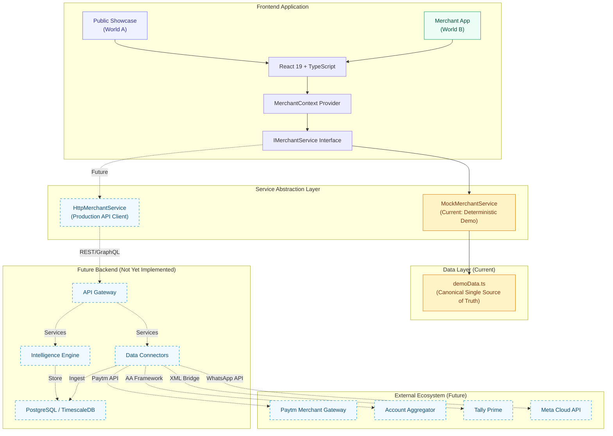

<](https://react.dev)
[](https://typescriptlang.org)
[](https://vite.dev)
[](https://tailwindcss.com)
[](https://vercel.com)

</div>

---

## Table of Contents

- [What is MerchantMind?](#what-is-merchantmind)
- [The Problem](#the-problem)
- [The Solution — Intelligence Lifecycle](#the-solution--intelligence-lifecycle)
- [Flagship Demo Scenario](#flagship-demo-scenario)
- [Product Architecture — Two Worlds](#product-architecture--two-worlds)
- [The Intelligence Story](#the-intelligence-story)
- [Evidence-First Design](#evidence-first-design)
- [Action Center & Closed-Loop Execution](#action-center--closed-loop-execution)
- [Paytm Ecosystem Integration](#paytm-ecosystem-integration)
- [System Architecture](#system-architecture)
- [Technology Stack](#technology-stack)
- [Project Structure](#project-structure)
- [Demo Data Architecture](#demo-data-architecture)
- [Getting Started](#getting-started)
- [Recommended Judge Demo Flow](#-recommended-judge-demo-flow)
- [Why MerchantMind?](#why-merchantmind)
- [Trust, Transparency & Guardrails](#trust-transparency--guardrails)
- [Current Status](#current-status)
- [Roadmap](#roadmap)
- [FAQ](#faq)
- [Team](#team)

---

## What is MerchantMind?

MerchantMind is **not** a dashboard, a bookkeeping app, or an AI chatbot.

It is a **Financial Operating System** — an intelligent decision platform that continuously monitors a merchant's financial position across payments, receivables, inventory, and supplier obligations, then:

1. **Detects** emerging risks and opportunities before they become crises
2. **Explains** why each issue matters with verifiable evidence
3. **Recommends** ranked, actionable interventions with trade-off analysis
4. **Executes** approved actions through integrated payment and communication channels
5. **Measures** the financial outcome of every action taken

The core thesis: **Indian retail merchants don't need more charts. They need to know _what is happening_, _why_, _what to do_, _how much they can recover_, and _what evidence proves it_.**

---

## The Problem

Millions of Indian SMB and retail merchants operate with fragmented financial information scattered across:

| Data Silo | Reality |
|---|---|
| **Payment Systems** | Paytm QR, UPI, cash register — each in a separate app |
| **Bank Accounts** | Statement PDFs downloaded monthly, if at all |
| **Khata / Udhar** | Customer credit tracked in notebooks or basic apps |
| **Supplier Bills** | Paper invoices filed in boxes, due dates in memory |
| **Inventory** | Manual stock counts, zero velocity tracking |
| **Accounting** | Tally or spreadsheets updated weekly at best |

The result is a merchant who runs a ₹1.5L/month business blind — unable to answer fundamental questions until it's too late:

> **"I have ₹40,607 in my account. My supplier bill of ₹45,000 is due Friday. Where do I find the remaining ₹4,393?"**

Traditional dashboards would show a revenue chart and a pie graph. MerchantMind answers the question, proves why it's correct, shows exactly where to recover the money, and helps execute the recovery — all before Friday.

---

## The Solution — Intelligence Lifecycle

MerchantMind operates on a continuous 9-stage autonomous intelligence pipeline:

```
CONNECT → UNDERSTAND → MONITOR → DETECT → EXPLAIN → RECOMMEND → APPROVE → ACT → MEASURE
```

| Stage | What Happens |
|---|---|
| **Connect** | Ingest data from Paytm QR, bank feeds, POS, Tally, inventory scanners, WhatsApp |
| **Understand** | Normalize raw transactions into a canonical financial model |
| **Monitor** | Continuously track cash position, receivables ageing, inventory velocity, supplier obligations |
| **Detect** | Identify signals — liquidity cliffs, overdue Khata, dead stock, margin leakage |
| **Explain** | Attribute each signal to specific source records with deterministic calculations |
| **Recommend** | Generate ranked actions with expected impact, effort, risk, and trade-offs |
| **Approve** | Merchant reviews and approves actions with 2-step confirmation guardrails |
| **Act** | Execute approved actions — send WhatsApp reminders, trigger clearance pricing, request supplier terms |
| **Measure** | Track financial outcome — did overdue Khata get collected? Did the liquidity gap close? |

---

## Flagship Demo Scenario

> **Merchant:** Rajesh Kumar — _Rajesh Mobile & Accessories_  
> **Location:** Shop #14, Raja Park Market, Jaipur, Rajasthan 302004  
> **GSTIN:** `08AABCR1234M1Z5`  
> **Category:** Consumer Electronics & Telecom (smartphones, accessories, repair)

### The Financial Story

Rajesh's business is growing — **₹1,42,800 monthly revenue** with +8.4% month-over-month growth and a 24.5% gross margin. But growth masks an acute cash squeeze:

```
  Available Operating Cash               ₹40,607    (SBI Current A/c ending 4910)
- Upcoming Supplier Obligation           ₹45,000    (Sharma Telecom, BILL-SUP-201, due in 5 days)
━━━━━━━━━━━━━━━━━━━━━━━━━━━━━━━━━━━━━━━━━━━━━━━━
= Immediate Liquidity Gap                -₹4,393    ⚠️ CRITICAL
```

Rajesh doesn't know this yet. His Khata notebook shows two customers owe him money, but he hasn't connected that to his supplier deadline. His back shelf has phone cases nobody buys anymore, but he doesn't see them as trapped cash.

**MerchantMind sees the full picture:**

| Source | Amount | Status |
|---|---|---|
| Overdue Khata — Amit Verma (`INV-REC-101`) | ₹2,200 | 38 days overdue |
| Overdue Khata — Neha Sharma (`INV-REC-103`) | ₹1,500 | 34 days overdue |
| Dead Stock — iPhone 11 Cases (`SKU-CS-IP11`) | ₹6,000 | 47 days stagnant |
| Dead Stock — Armband Pouches (`SKU-ARM-POUCH`) | ₹3,040 | 52 days stagnant |
| Dead Stock — OTG Adapters (`SKU-OTG-MICRO`) | ₹1,620 | 58 days stagnant |

**Recovery Path:**

```
  Recover overdue Khata                  ₹3,700     (WhatsApp UPI paylinks to 2 customers)
+ Dead stock flash clearance             ₹7,800     (48-hour weekend sale on 3 obsolete SKUs)
━━━━━━━━━━━━━━━━━━━━━━━━━━━━━━━━━━━━━━━━━━━━━━━━
= Total Potential Recovery              ₹11,500
- Current Liquidity Gap                 -₹4,393
━━━━━━━━━━━━━━━━━━━━━━━━━━━━━━━━━━━━━━━━━━━━━━━━
= Projected Post-Recovery Surplus       +₹7,107    ✅ SAFE
```

Every single number above is deterministic, traceable to source records, and consistent across all 19 views in the application.

---

## Product Architecture — Two Worlds

MerchantMind is structured as two complementary product experiences:

### World A — Public Showcase

The **judge and product storytelling layer**. A visitor lands here first and understands the product without needing a developer to explain it.

| Section | Purpose |
|---|---|
| **Hero & Value Proposition** | 30-second elevator pitch with live capability flow |
| **The Merchant Problem** | Visual explanation of fragmented merchant data reality |
| **The MerchantMind Solution** | 9-stage intelligence lifecycle with interactive cards |
| **How It Works** | Step-by-step product walkthrough with animated state changes |
| **Enterprise Architecture** | Interactive data pipeline and canonical model diagram |
| **Paytm Ecosystem Blueprint** | Sponsor-aligned integration surfaces with honest demo disclosures |
| **5 Core Questions for Judges** | _What is it? Who is it for? What problem? How does it work? Why different?_ |
| **Interactive Guided Tour** | One-click launch into the merchant experience |

### World B — Merchant App

The **operational financial intelligence interface**. This is the actual product Rajesh would use daily.

| Screen | What It Does | What the Merchant Learns | What Action Follows |
|---|---|---|---|
| **Command Center** | Executive overview with top KPIs and priority alerts | "I have a ₹4,393 cash gap in 5 days" | Inspect evidence, view recovery options |
| **Financial Health** | P&L indicators, margins, burn rate, runway analysis | "My 24.5% margin is healthy but my cash runway is only 11 days" | Monitor trend direction |
| **Cashflow & Cliff** | Daily projection curve with cliff detection | "My balance drops to ₹5,607 on Oct 9 when Sharma's bill hits" | Trigger pre-emptive recovery |
| **Transactions** | Unified ledger across Paytm, UPI, cash, netbanking | "My last 5 transactions and their settlement status" | Verify individual records |
| **Khata / Receivables** | Ageing buckets (0-7, 8-30, 31-60, 61-90, 90+) with risk scoring | "₹3,700 is trapped in 2 customers past 30 days" | Send WhatsApp payment reminder |
| **Supplier Payables** | Invoice schedules, cliff flags, early-pay discount alerts | "₹45,000 due to Sharma Telecom in 5 days, 1.5% discount available" | Negotiate, reschedule, or prioritize |
| **Inventory Velocity** | SKU turnover, dead stock detection, capital lockup analysis | "₹10,660 is locked in 3 items with zero sales in 47+ days" | Launch clearance sale |
| **Customers & Credit** | Segments (High-Value / Growing / At-Risk / Dormant), RFM metrics | "Amit Verma's risk score is 78 — he's a chronic late payer" | Adjust credit limits |
| **Signal Radar** | Deterministic anomaly and threshold alerts | "3 active signals: liquidity cliff, overdue Khata, dead stock" | Drill into any signal |
| **Opportunity Center** | Categorized, ranked financial opportunities with impact tags | "5 open opportunities totaling ₹99,967 exposure" | Review evidence, approve actions |
| **Action Center** | Approval queue with execution simulation and outcome measurement | "Action approved → Executing → Measured: deficit closed" | Close the loop |
| **Connections & Paytm** | Integration hub showing 9 data sources with sync health | "Paytm QR is synced, Tally is connected, Khatabook is ready" | Trigger live sync simulation |
| **Ingestion & Quarantine** | Pipeline telemetry, validation status, quarantined records | "22 of 24 CSV records validated, 2 quarantined for missing GSTIN" | Fix data quality issues |
| **Audit Trail** | Immutable event timeline of signals, actions, and syncs | "Full history: signal detected → action approved → outcome measured" | Verify system integrity |
| **How MerchantMind Works** | In-app step-by-step interactive guide | Product understanding without leaving the app | Self-onboarding |
| **Enterprise Architecture** | Technical data pipeline and system diagram | Architecture comprehension for technical judges | Developer evaluation |
| **Paytm Ecosystem Hub** | Detailed Paytm integration surface documentation | Integration depth and production readiness | Sponsor assessment |
| **Business Profile** | Merchant settings, profile, and scenario management | Configuration and personalization | Scenario switching |

---

## The Intelligence Story

MerchantMind distinguishes between six discrete concepts that most financial tools conflate:

```
DATA         Raw transaction records, invoices, bank entries
     ↓
SIGNAL       A deterministic anomaly or threshold breach detected from data
     ↓
OPPORTUNITY  A financially quantified situation requiring merchant attention
     ↓
EVIDENCE     Verifiable calculation breakdown linking opportunity to source records
     ↓
ACTION       A specific intervention with expected impact, effort, risk, and trade-offs
     ↓
OUTCOME      Measured financial result of an executed action
```

### Why This Matters

Most tools stop at **DATA** (here's a chart) or **SIGNAL** (here's an alert). MerchantMind goes the full distance:

- A **signal** like `SIG-LIQ-CLIFF` tells the merchant _something is wrong_
- An **opportunity** like `opp_01` quantifies _how much money is at risk_ (₹45,000 exposure, ₹11,500 recoverable)
- **Evidence** record `evi_01` proves the calculation: `₹40,607 - ₹45,000 = -₹4,393` with links to `BILL-SUP-201`, `INV-REC-101`, `INV-REC-103`
- **Actions** `act_01`, `act_02`, `act_03` are three ranked interventions with trade-off analysis
- **Outcome measurement** verifies: did the deficit actually close? (Answer: `-₹4,393 → +₹7,107`)

---

## Evidence-First Design

> **No black-box claims. Every recommendation is traceable to source records.**

MerchantMind does not simply generate recommendations. Every important recommendation is auditable:

| Evidence Component | Example |
|---|---|
| **What was detected** | "Deterministic cash deficit of ₹4,393 on Oct 9 when BILL-SUP-201 matures" |
| **Why it matters** | "Defaulting costs ₹1,200 bank fee + vendor credit hold; emergency loan costs 36% APR" |
| **Calculation breakdown** | `₹40,607 (operating cash) - ₹45,000 (BILL-SUP-201) = -₹4,393` |
| **Source records** | BILL-SUP-201, SBI-OP-BAL, INV-REC-101, INV-REC-103 |
| **Audit timeline** | Bill ingested Sep 9 → Liquidity warning Oct 1 → Signal generated Oct 4 |
| **Risks & trade-offs** | "Delaying payment loses 1.5% discount (₹675). Khata recovery + clearance covers gap without borrowing." |

The **Evidence Drawer** is accessible from any opportunity, signal, or action card — opening a slide-over panel with the full deterministic calculation tree, source invoice table, and audit trail.

---

## Action Center & Closed-Loop Execution

MerchantMind is not designed to stop at "here is a problem." It moves toward:

```
DETECT → DECIDE → ACT → MEASURE
```

### Action Lifecycle

| Stage | Description |
|---|---|
| `DRAFT` | Action auto-generated by intelligence engine |
| `AWAITING_APPROVAL` | Ready for merchant review with 2-step confirmation |
| `APPROVED` | Merchant has authorized execution |
| `EXECUTING (Simulated)` | Action steps running with progress logs |
| `COMPLETED` | All steps finished |
| `MEASURED` | Financial outcome verified against projection |

### Current Demo Actions

| # | Action | Type | Expected Recovery | Effort | Risk |
|---|---|---|---|---|---|
| 1 | Dispatch WhatsApp UPI paylinks to Amit & Neha | `SEND_REMINDER` | ₹3,700 | Low | Negligible |
| 2 | 48-hour flash clearance on stagnant SKUs | `DISCOUNT_CLEARANCE` | ₹7,800 | Medium | Negligible |
| 3 | Request 7-day split payment from Sharma Telecom | `RESCHEDULE_SUPPLIER` | ₹20,000 deferred | Low | Low |

### Outcome Verification

After simulated execution, the **Closed-Loop Outcome Panel** shows the transformation:

```
BEFORE:  -₹4,393 deficit    (₹40,607 cash vs ₹45,000 obligation)
AFTER:   +₹7,107 surplus    (₹3,700 Khata recovered + ₹7,800 clearance cash)
```

> ⚠️ **Sandbox Disclosure:** Current action execution is a **deterministic demo simulation**. Production execution would connect to real WhatsApp Business API, Paytm payment flows, and supplier communication channels.

---

## Paytm Ecosystem Integration

Paytm is presented as a primary payment ecosystem partner with 6 integration surfaces:

| Integration Surface | Description | Status |
|---|---|---|
| **Real-Time QR Inflow** | Continuous Paytm QR standee transaction ingestion | Demo Telemetry |
| **Soundbox Voice Alerts** | Audio confirmation events feeding into cashflow ledger | Demo Telemetry |
| **EDC Terminal Settlements** | Card + UPI terminal batch settlement reconciliation | Illustrative Flow |
| **UPI Transaction Velocity** | Intraday payment frequency and average ticket analysis | Demo Telemetry |
| **Merchant Telemetry** | Aggregated business health signals from payment patterns | Illustrative Flow |
| **WhatsApp Payment Flows** | UPI paylink dispatch via Paytm-powered deep links | Connector Ready |

### Live Sync Simulation

The Connections screen includes a 7-stage sync simulation:

```
CONNECTING → AUTHENTICATING → FETCHING → NORMALIZING → VALIDATING → RECONCILING → COMPLETE
```

Each stage shows real-time telemetry (records ingested, schemas validated, duplicates removed) with explicit demo mode indicators.

### Important Disclosures

- **Demo Telemetry** — All Paytm data is simulated from the deterministic demo scenario
- **Illustrative Integration Flow** — Architecture demonstrates production-ready connector patterns
- **Production Connector Boundary** — Real integration would use Paytm Merchant API, OAuth2 authentication, and webhook-based event streaming
- No production Paytm API credentials are used or claimed

---

## System Architecture

### Current Architecture



> **Solid lines** = currently implemented. **Dashed lines** = future production components.

### Intelligence Pipeline

```mermaid
graph LR
    A["Connect<br/>Data Sources"] --> B["Understand<br/>Canonical Model"]
    B --> C["Monitor<br/>Continuous Tracking"]
    C --> D["Detect<br/>Signal Engine"]
    D --> E["Explain<br/>Evidence Builder"]
    E --> F["Recommend<br/>Action Generator"]
    F --> G["Approve<br/>Merchant Guardrails"]
    G --> H["Act<br/>Execution Engine"]
    H --> I["Measure<br/>Outcome Verification"]

    style A fill:#EEF2FF,stroke:#6366F1,color:#312E81
    style B fill:#EEF2FF,stroke:#6366F1,color:#312E81
    style C fill:#ECFDF5,stroke:#059669,color:#064E3B
    style D fill:#FEF2F2,stroke:#E11D48,color:#881337
    style E fill:#FEF2F2,stroke:#E11D48,color:#881337
    style F fill:#FEF3C7,stroke:#D97706,color:#78350F
    style G fill:#FEF3C7,stroke:#D97706,color:#78350F
    style H fill:#ECFDF5,stroke:#059669,color:#064E3B
    style I fill:#ECFDF5,stroke:#059669,color:#064E3B
```



---

## Technology Stack

All dependencies verified from `package.json`:

| Layer | Technology | Version | Purpose |
|---|---|---|---|
| **Runtime** | React | 19.2 | Component architecture & reactive state |
| **Language** | TypeScript | ~6.0 | Strict type contracts across all domain models |
| **Build** | Vite | 8.3 | Sub-second HMR, optimized production builds |
| **Styling** | Tailwind CSS | 4.3 | Utility-first design system with `@tailwindcss/vite` plugin |
| **Icons** | Lucide React | 1.52 | Consistent, tree-shakeable icon library |
| **Utilities** | clsx + tailwind-merge | 2.1 / 3.7 | Conditional class composition without conflicts |
| **Typography** | Inter + JetBrains Mono | Google Fonts | Premium sans-serif body + monospaced financial numerals |
| **Linting** | oxlint | 1.81 | Fast Rust-based linter |
| **Deployment** | Vercel | SPA mode | Zero-config static deployment with rewrite rules |

---

## Project Structure

```
merchantmind/
├── index.html                          # Entry point with SEO meta, fonts, viewport
├── package.json                        # Dependencies and scripts
├── vite.config.ts                      # Vite + React + Tailwind CSS plugin
├── vercel.json                         # SPA rewrite rules for Vercel deployment
├── tsconfig.json                       # TypeScript project references
│
├── docs/
│   ├── MASTER_BLUEPRINT.md             # Product vision, architecture, design system
│   └── PROJECT_STATE.md                # Current implementation status tracker
│
├── src/
│   ├── main.tsx                        # React DOM entry point
│   ├── App.tsx                         # World switcher (Showcase ↔ Merchant App)
│   ├── App.css                         # Global custom CSS and animations
│   ├── index.css                       # Tailwind CSS imports and base styles
│   │
│   ├── types/
│   │   └── index.ts                    # 18 TypeScript domain contracts
│   │                                   #   MerchantProfile, FinancialHealthMetrics,
│   │                                   #   CashflowDatapoint, ReceivableRecord,
│   │                                   #   PayableRecord, InventoryItem, CustomerProfile,
│   │                                   #   BusinessSignal, Opportunity, EvidenceRecord,
│   │                                   #   RecommendedAction, DataConnection,
│   │                                   #   IngestionJobLog, AuditEvent, TransactionRecord,
│   │                                   #   MerchantActivityEvent, and enums
│   │
│   ├── mock/
│   │   └── demoData.ts                 # Single source of truth (1,195 lines)
│   │                                   #   All financial numbers, records, scenarios
│   │                                   #   derive from this file exclusively
│   │
│   ├── services/
│   │   ├── types.ts                    # IMerchantService interface (22 methods)
│   │   └── MockMerchantService.ts      # Deterministic implementation with simulation
│   │
│   ├── context/
│   │   └── MerchantContext.tsx          # React Context provider — global state,
│   │                                   #   world/tab navigation, evidence drawer,
│   │                                   #   action simulation, guided tour, demo reset
│   │
│   ├── layouts/
│   │   ├── AppShell.tsx                # Merchant app shell (sidebar + topbar + content)
│   │   ├── PublicShell.tsx             # Public showcase shell (topbar + content)
│   │   ├── TopNavbar.tsx               # World switcher, demo controller, sync status
│   │   ├── AppSidebar.tsx              # 5-section navigation with live badges
│   │   ├── DemoModeBanner.tsx          # Persistent demo mode disclosure ribbon
│   │   ├── EvidenceDrawer.tsx          # Slide-over evidence inspection panel
│   │   └── GuidedTourModal.tsx         # 10-step interactive judge tour
│   │
│   ├── components/
│   │   ├── ui/                         # Foundation design system
│   │   │   ├── Badge.tsx               # Status badges with color variants
│   │   │   ├── Button.tsx              # Primary/secondary/ghost buttons
│   │   │   ├── Card.tsx                # Elevated card container
│   │   │   ├── Drawer.tsx              # Slide-over panel
│   │   │   └── Modal.tsx               # Dialog overlay
│   │   ├── showcase/
│   │   │   └── ProductFaqGrid.tsx      # Interactive FAQ accordion for judges
│   │   ├── intelligence/
│   │   │   ├── SignalActionFlowCard.tsx # Signal → Action visual flow
│   │   │   └── MerchantActivityTimeline.tsx  # Real-time activity feed
│   │   └── connections/
│   │       ├── ConnectionDetailsModal.tsx    # Data source detail inspector
│   │       └── LiveSyncSimulationModal.tsx   # 7-stage sync simulation
│   │
│   ├── views/                          # 19 view components (one per screen)
│   │   ├── PublicShowcaseView.tsx       # World A landing page (78KB — largest view)
│   │   ├── CommandCenterView.tsx        # Executive dashboard with squeeze alert
│   │   ├── FinancialHealthView.tsx      # P&L and health indicators
│   │   ├── CashflowView.tsx            # Daily projection with cliff detection
│   │   ├── TransactionsView.tsx        # Unified transaction ledger
│   │   ├── KhataReceivablesView.tsx    # Ageing buckets and reminder dispatch
│   │   ├── SupplierPayablesView.tsx    # Supplier bills and cliff flags
│   │   ├── InventoryView.tsx           # SKU velocity and dead stock analysis
│   │   ├── CustomersView.tsx           # Segments, RFM, credit risk scoring
│   │   ├── SignalsView.tsx             # Business signal radar
│   │   ├── OpportunitiesView.tsx       # Ranked opportunity center
│   │   ├── ActionCenterView.tsx        # Approval queue and execution simulator
│   │   ├── ConnectionsView.tsx         # 9 data source integration hub
│   │   ├── IngestionView.tsx           # Pipeline telemetry and quarantine log
│   │   ├── AuditTrailView.tsx          # Immutable event timeline
│   │   ├── HowItWorksView.tsx          # Interactive product walkthrough
│   │   ├── ArchitectureView.tsx        # Technical architecture diagram
│   │   ├── PaytmEcosystemView.tsx      # Paytm integration documentation
│   │   └── SettingsView.tsx            # Merchant profile and scenario management
│   │
│   └── utils/
│       ├── cn.ts                       # clsx + tailwind-merge utility
│       └── formatters.ts              # Currency, percentage, date formatting
```

---

## Demo Data Architecture

MerchantMind uses **centralized deterministic demo data** by deliberate design choice:

### Why Deterministic?

| Principle | Explanation |
|---|---|
| **Single source of truth** | Every financial number in the UI derives from `src/mock/demoData.ts` |
| **Mathematical consistency** | ₹40,607 − ₹45,000 = −₹4,393 is always correct on every screen |
| **Reproducible demo** | Any judge sees identical data — no random variance or session drift |
| **No hallucinated values** | Zero randomly generated numbers; every value is hand-verified |
| **Easy backend replacement** | `IMerchantService` provides the abstraction boundary |

### Service Abstraction

All 19 views query data through the `IMerchantService` interface (22 methods), injected via `MerchantContext`. The current implementation is `MockMerchantService`, which reads from `demoData.ts`.

When a production backend is ready, swapping to a real API client requires **zero changes** to any UI component:

```typescript
// Current (demo)
const service = new MockMerchantService();

// Future (production) — same interface, different implementation
const service = new HttpMerchantService('https://api.merchantmind.com/v1');
```

---


## 🎬 Recommended Judge Demo Flow

A guided walkthrough designed for a **2–4 minute** hackathon presentation.

### Step 1 — Public Showcase (0:00–0:30)

**Show:** Landing page hero and product story  
**Say:** _"MerchantMind is a financial operating system for Indian retail merchants. It connects fragmented data and turns it into evidence-backed decisions."_  
**Why it matters:** Establishes product category — this is not a dashboard or chatbot.

### Step 2 — The Problem (0:30–0:45)

**Show:** Scroll to the problem section on the showcase  
**Say:** _"Millions of merchants run ₹1-2L/month businesses with data scattered across Paytm, bank statements, Khata notebooks, and Tally. They can't answer: do I have enough cash to pay my supplier on Friday?"_  
**Why it matters:** Anchors the real-world pain point.

### Step 3 — Enter the Merchant App (0:45–1:00)

**Show:** Click "Launch Merchant App" to switch to World B → Command Center  
**Say:** _"Let's look at Rajesh Kumar's mobile shop in Jaipur. He earns ₹1.4L/month but has a crisis he doesn't know about yet."_  
**Why it matters:** Transitions from storytelling to the live product.

### Step 4 — The Liquidity Squeeze (1:00–1:15)

**Show:** Command Center alert banner — ₹45,000 due vs ₹40,607 available  
**Say:** _"MerchantMind has detected a ₹4,393 liquidity gap. In 5 days, Rajesh won't be able to pay his supplier Sharma Telecom."_  
**Why it matters:** Demonstrates proactive detection, not reactive reporting.

### Step 5 — Inspect the Evidence (1:15–1:45)

**Show:** Open Evidence Drawer from the opportunity card  
**Say:** _"Every claim is backed by deterministic evidence. Here's the exact calculation: ₹40,607 minus ₹45,000 equals negative ₹4,393. Here are the source invoices. Here's the audit trail showing when each record was ingested."_  
**Why it matters:** This is the core differentiator — transparency and verifiability.

### Step 6 — Data Connections & Paytm (1:45–2:00)

**Show:** Navigate to Connections & Paytm → trigger Live Sync Simulation  
**Say:** _"MerchantMind ingests data from Paytm QR, SBI netbanking, POS, Tally, and inventory systems. Watch the 7-stage sync pipeline."_  
**Why it matters:** Shows data infrastructure and Paytm ecosystem alignment.

### Step 7 — Financial Modules (2:00–2:15)

**Show:** Quick scan through Cashflow (cliff visualization), Khata (ageing buckets), Inventory (dead stock)  
**Say:** _"The financial modules show where cash is trapped: ₹3,700 in overdue Khata, ₹10,660 in dead stock. Total exposure across all opportunities: ₹99,967."_  
**Why it matters:** Demonstrates operational depth across working capital dimensions.

### Step 8 — Opportunities & Actions (2:15–2:30)

**Show:** Opportunity Center → select the critical opportunity → view ranked actions  
**Say:** _"MerchantMind generates 3 ranked actions: send WhatsApp paylinks to recover ₹3,700, launch a flash clearance to unlock ₹7,800, or negotiate with the supplier. Each action shows expected impact, effort, and risk."_  
**Why it matters:** Shows the RECOMMEND stage with trade-off analysis.

### Step 9 — Execute & Measure (2:30–2:50)

**Show:** Action Center → Approve action → Watch execution simulation → Outcome panel  
**Say:** _"Rajesh approves the action. MerchantMind simulates execution and measures the outcome: deficit closed, surplus of ₹7,107."_  
**Why it matters:** Demonstrates the full APPROVE → ACT → MEASURE closed loop.

### Step 10 — Architecture & Guided Tour (2:50–3:00)

**Show:** Architecture view or trigger the 10-step Guided Tour  
**Say:** _"The entire system is built on a service abstraction layer. The mock data layer can be replaced with a production backend without changing any UI code."_  
**Why it matters:** Technical credibility for engineering evaluation.

---

## Why MerchantMind?

| Dimension | Traditional Dashboard | MerchantMind |
|---|---|---|
| **Core question** | _"What happened?"_ | _"What happened + Why + What to do + How much to recover + What proves it?"_ |
| **Data model** | Disconnected charts per data source | Unified canonical model across all sources |
| **Alerts** | Generic threshold notifications | Contextual signals with financial attribution |
| **Recommendations** | None — user interprets charts | Ranked actions with trade-off analysis |
| **Evidence** | None — trust the chart | Full calculation tree + source record links |
| **Execution** | None — "see your accountant" | 1-click approved actions with progress tracking |
| **Outcome** | None | Measured delta: _"deficit closed, surplus achieved"_ |
| **Audit** | None | Immutable event trail from detection to outcome |

---

## Trust, Transparency & Guardrails

| Principle | Implementation |
|---|---|
| **Deterministic calculations** | All financial computations use exact arithmetic from canonical records — no probabilistic estimates in the demo |
| **Evidence traceability** | Every opportunity links to source records (invoices, bills, SKU entries) via the Evidence Drawer |
| **Explicit demo boundaries** | Persistent `Demo Mode` banner, honest connection status badges (`Demo Connected`, `Connector Ready`, `Coming Soon`) |
| **Action sandbox** | 2-step approval confirmation with explicit "This is a simulated execution" disclosure |
| **Audit trail** | Every signal detection, action approval, and sync event is logged with timestamp and actor |
| **No black-box claims** | The system explains _how_ it arrived at every recommendation |

---

## Current Status

### ✅ Complete — Implemented & Verified

- [x] Frontend application architecture (React 19, TypeScript, Vite)
- [x] Design system (Tailwind CSS 4, Inter typography, fintech-grade aesthetics)
- [x] Public Showcase with product storytelling (World A)
- [x] 19-screen Merchant App (World B) with full navigation
- [x] Centralized deterministic demo data (1,195 lines, mathematically verified)
- [x] Service abstraction layer (`IMerchantService` with 22 methods)
- [x] Executive Command Center with liquidity squeeze alert
- [x] Evidence Drawer with calculation breakdown and source records
- [x] 5 ranked opportunities with ₹99,967 total exposure
- [x] 3 recommended actions with impact/effort/risk analysis
- [x] Action Center with 5-stage execution lifecycle simulation
- [x] Closed-loop outcome measurement (-₹4,393 → +₹7,107)
- [x] 9 data source connections with sync health badges
- [x] 7-stage live sync simulation (Paytm-aligned)
- [x] Ingestion pipeline telemetry with quarantine logging
- [x] Immutable audit trail
- [x] 10-step interactive Guided Judge Tour
- [x] Demo controller (reset, restart scenario, replay tour)
- [x] Responsive layout (desktop, tablet, mobile)
- [x] Production build passing (`npm run build` — 0 errors)
- [x] Vercel deployment configuration

### 🟡 Future — Not Yet Implemented

- [ ] Production backend (Node.js / Python microservices)
- [ ] PostgreSQL / TimescaleDB data persistence
- [ ] Real authentication and merchant onboarding
- [ ] Production Paytm Merchant API connector
- [ ] Account Aggregator bank feed integration
- [ ] Real Tally Prime XML bridge connector
- [ ] WhatsApp Business Cloud API for action execution
- [ ] Production ML models (seasonal forecasting, churn prediction)
- [ ] Multi-tenant merchant isolation
- [ ] Real ingestion pipeline with schema validation

---

## Roadmap

| Phase | Focus | Status |
|---|---|---|
| **Phase 1** | Frontend Product Experience — complete merchant intelligence UI with deterministic demo data, 19 screens, evidence system, action center, and Paytm ecosystem showcase | ✅ **Complete** |
| **Phase 2** | Backend Service Integration — implement `HttpMerchantService`, REST/GraphQL API, authentication, PostgreSQL persistence | 🔲 Planned |
| **Phase 3** | Production Data Connectors — Paytm API, Account Aggregator, Tally XML, POS webhooks, WhatsApp Cloud API | 🔲 Planned |
| **Phase 4** | Production Intelligence — real-time signal engine, opportunity scoring with historical data, action execution pipelines | 🔲 Planned |
| **Phase 5** | Advanced ML & Merchant Copilot — seasonal demand forecasting, customer churn prediction, natural language merchant assistant | 🔲 Future |

---

## FAQ

**What exactly is MerchantMind?**  
A financial operating system that connects a merchant's fragmented data sources (payments, bank, Khata, inventory, suppliers) and turns them into evidence-backed decisions and measurable actions. Not a dashboard, not a chatbot, not a bookkeeping tool.

**Who is it for?**  
Indian retail and SMB merchants — particularly those running ₹50K–₹5L/month businesses with 2–10 data sources, customer credit (Khata), supplier obligations, and inventory to manage.

**Is this an accounting application?**  
No. Accounting tools record what happened. MerchantMind detects what's about to happen, explains why, and helps the merchant act before it becomes a problem.

**Is this an AI chatbot?**  
No. MerchantMind uses deterministic intelligence — rule-based calculations over structured financial data. There is no LLM or generative AI in the current implementation. Future phases may add ML models for forecasting and trend analysis.

**Where does the financial data come from?**  
Currently from a centralized deterministic demo dataset (`demoData.ts`). In production, data would flow from Paytm merchant APIs, bank Account Aggregator feeds, Tally connectors, POS systems, and manual CSV imports.

**Is Paytm actually connected?**  
The current demo shows a simulated Paytm integration with illustrative telemetry data. The architecture is designed for production Paytm API integration. No real Paytm API credentials are used.

**Is the demo using real backend data?**  
No. The entire frontend operates on deterministic mock data. This is intentional — it ensures mathematical consistency and reproducible demos. The service abstraction layer (`IMerchantService`) allows swapping to a real backend without changing UI code.

**How does MerchantMind avoid hallucinated recommendations?**  
Every recommendation is derived from deterministic calculations over canonical data. The Evidence Drawer shows the exact formula, source records, and audit trail. No generative AI, no probabilistic guessing, no invented numbers.

**What makes the opportunity engine different?**  
It doesn't just say "you have overdue receivables." It says "₹3,700 is trapped in 2 customer Khata ledgers (Amit: ₹2,200 / 38 days, Neha: ₹1,500 / 34 days). Recovering this via WhatsApp UPI paylinks costs low effort, has negligible relationship risk, and covers 84% of your ₹4,393 liquidity gap."

**How does evidence work?**  
Every opportunity links to an evidence record containing: what was detected, why it matters, the exact calculation breakdown with step-by-step arithmetic, links to source invoices/bills/SKUs, an audit timeline of detection events, and risk/trade-off analysis.

**How would production deployment work?**  
1. Implement `HttpMerchantService` calling a backend API
2. Backend connects to real data sources via connectors
3. Swap the service instance in `MerchantContext`
4. Frontend works unchanged — same views, same components, real data

**What happens after the hackathon?**  
The service abstraction architecture means this frontend is not throwaway demo code. It's a production-ready UI layer waiting for backend integration.

---

## Team AARAMBH CODERS

**Praveen Kumar Singh** — [pr4veensingh@proton.me](mailto:pr4veensingh@proton.me)  
**Ankita Mishra** — [ankitadotdev@gmail.com](mailto:ankitadotdev@gmail.com)

---

<div align="center">

_Built for the merchant who deserves to know what's happening in their business — and what to do about it._

</div>
]]>
